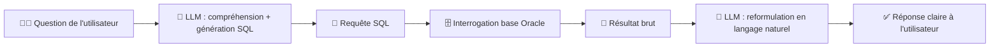

```mermaid
flowchart LR
    A[🧑‍💻 Question de l'utilisateur] --> B[🧠 LLM : compréhension + génération SQL]
    B --> C[📄 Requête SQL]
    C --> D[🗄️ Interrogation base Oracle]

    D --> E[📄 Résultat brut]
    E --> F[🧠 LLM : reformulation en langage naturel]
    F --> G[✅ Réponse claire à l'utilisateur]
```
