```mermaid
flowchart TD
    M[👑 Monster<br/>Manager] --> A[🧑‍💼 Adrien<br/>Sous-Chef]
    M --> S[💻 SEng]
    M --> AN[🧑‍🎓 Anthony<br/>Stagiaire]
    M --> SO[💡 Soline]
    M --> P[🔧 Philippe]

    A --> R[🧑‍🔬 Robin<br/>Externe]
    A --> D[🧑‍🔬 Damien<br/>Externe]

    classDef managerClass fill:#ffe082,stroke:#ffb300,stroke-width:2px
    classDef sousChefClass fill:#b2dfdb,stroke:#009688,stroke-width:2px
    classDef membreClass fill:#d1c4e9,stroke:#7e57c2
    classDef externeClass fill:#ffccbc,stroke:#d84315
    classDef stagiaireClass fill:#b3e5fc,stroke:#0288d1

    class M managerClass
    class A sousChefClass
    class S,SO,P membreClass
    class R,D externeClass
    class AN stagiaireClass
```

```mermaid
bar
    title Nombre de bateaux à Rotterdam par année
    x-axis 2018, 2019, 2020, 2021, 2022
    y-axis Nombre de bateaux
    2018: 1234
    2019: 1456
    2020: 1320
    2021: 1512
    2022: 1478
```

---

### **Line Chart (courbe)**

```mermaid
line
    title Nombre de bateaux à Rotterdam par année
    x-axis 2018, 2019, 2020, 2021, 2022
    y-axis Nombre de bateaux
    "Rotterdam": 1234, 1456, 1320, 1512, 1478
```
